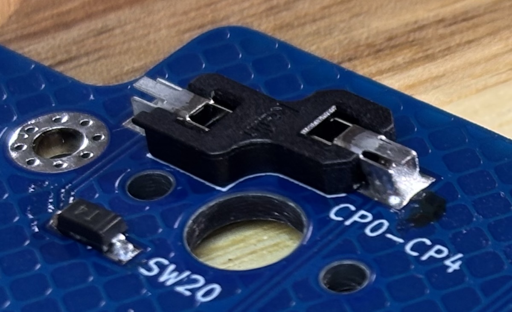
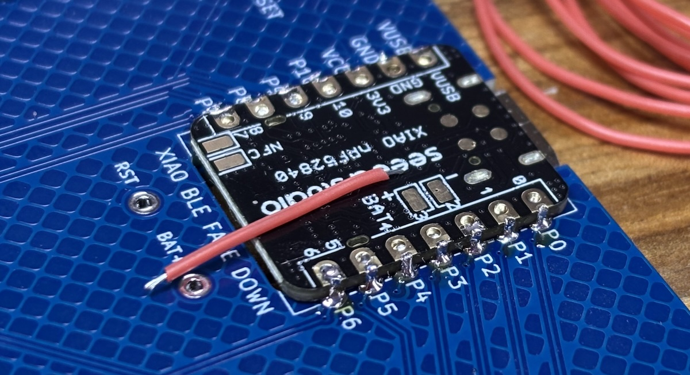
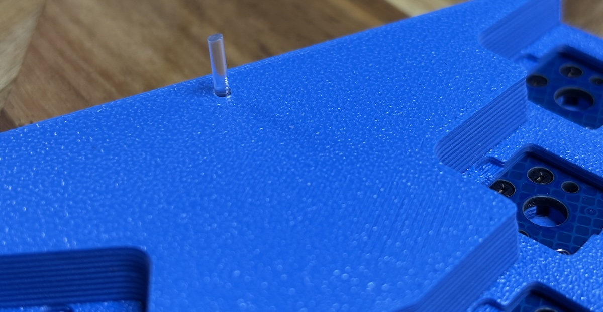

# Charlieflex Build Guide

If this is your first time building a custom keyboard,
you should do two things before attempting this build.

- watch a few [soldering][how-to-solder] [tutorials][soldering101]
- read through a detailed build guide like
  the one for the [splitkb.com Aurora Series][splitkb-build-guide]

The remainder of this build guide will assume a basic familiarity with the process
and will only hit upon specific items that may be different or important to note while
building the Charlieflex.

## Bill of materials

| Qty   | Description                                                                                            |
| ----- | ------------------------------------------------------------------------------------------------------ |
| 1     | [Charlieflex PCB][pcb] (can be printed by uploading the [zip file][gerber] to [JLC][jlcpcb])           |
| 3     | [3D printed cases][case], bottom, top, and attic                                                       |
| 1     | [XIAO BLE][xiao] or compatible board of your choice, as long as it is supported by [ZMK][zmk-xiao]     |
| 1     | [SMD 5x5x3 tactile switch][reset] for the reset button (similar to [this][pts526] or [this][ts18])     |
| 1     | wireless only: [Alps SSSS811101 SPDT slide switch][power] for the battery on/off                       |
| 1     | wireless only: [3.7v 300mAh 502530 LiPo battery][battery] or smaller (max internal space: 5.5x27x32mm) |
| 1     | wireless only: [JST PH 2 battery jack][jst]                                                            |
| 45    | SOD-123 [1N4148W SMD diodes][sod123]                                                                   |
| 30-32 | Kailh [choc hot swap sockets][sockets]                                                                 |
| 30-32 | [Choc v1][chocv1] or [v2 switches][chocv2] of your choice                                              |
| 30-32 | [Low profile choc v1][chockeycaps] or [v2 keycaps][mxkeycaps] of your choice                           |
| 1     | Bourns [PEC11L-4115F-S0020][encoder]\* EC11 encoder with a [knob][case-knob] of your choice            |
| 9     | [M2 x 6mm countersunk screws][screws6mm]                                                               |
| 9     | [M2 hex nuts][hexnuts]                                                                                 |
| 3     | [M2 x 10mm countersunk screws][screws10mm]                                                             |
| 3     | [M2 heat-set inserts 3mm x 3mm][heatset]                                                               |
| 10    | [6mm x 1.5mm bumpons][bumpons]                                                                         |
| ~1cm  | [1.75mm transparent 3D printer filament][filament] for the "fiber optic" led light guide               |
| 2     | short (1-2cm) [26 gauge electrical wire][wire], preferably in two different colors                     |

\* You could also use a Bourns [PES12-42S][smallencoder] EC12 encoder,
or an encoder from another manufacturer if you aren't going wireless,
but the specified encoder is designed to have its detents with both A and B set to low,
so a different option is likely to draw more power,
and thus isn't the best choice for a wireless build.

## Useful equipment

You should ideally have access to:

- a [soldering iron][pinecil]
- a [heat-set insert tool][heatsettool]
- some [good quality solder][kester]
- a decent hands-free magnifying glass
- precision tweezers
- wire cutter / stripper
- isopropyl alcohol and an old toothbrush

## Getting the PCB

The PCB can be easily ordered from a circuit board manufacturer with an online store.
I used [JLC][jlcpcb] because--at least at the time of my order--their prices are unbeatable.

To order, you can simply upload the [gerber zip file][gerber] to their website,
accept all of the defaults, and wait a week or two for the boards to arrive.

However, the minimum order at JLC is 5 copies, so you'll likely end up
with 4 extra PCBs. I don't really have any advice for what to do with
the extras, but you maybe could give one to a friend!

A few items that you may want to customize:

- the color of the board; I printed mine in blue
- I also chose to hide the JLC order number, to give the board a cleaner look
- HASL can be lead-free if you are also using lead-free solder, or you can splurge for ENIG, but it's definitely not required

## Getting the case

If you have access to a 3D printer, the [case][case] is very easy to print yourself.
If you have a Bambu printer, I uploaded printer profiles to their [makerworld][bambu] website.

If you don't have your own printer, no worries.
You will probably want to send in your print order around the same time you order the PCB.
I've used [JLC][jlc3dp] in the past with good results.

Just remember that you should print the top-most piece of the case,
called "attic" in the [case list][case],
in nylon or PLA rather than resin,
though all other parts of the case can be printed in resin.
The reason for this is that the design calls for heat-set inserts
to be melted into that piece, and resin doesn't work for that.

## General soldering order

Although you can work in any order you prefer,
I like to start with the smaller components, then move to the larger,
and finish with bulky items that go on the top of the board.

So, the order I install:

### Installed on the bottom of the board

- diodes
- hotswap sockets
- power switch
- reset switch
- xiao
- reset and battery wire connections to xiao

### Bulky items, assembled on the top of the board, but soldered on the bottom

- jst
- encoder

## Step-by-step instructions

Let's get started, shall we?

### Solder the diodes

Diodes are directional components, and must be soldered in the correct orientation.

To determine the orientation, look for a line printed on one edge of the diode.
You may need to use a magnifier glass and adjust the angle of light hitting the diode
in order to see it clearly.
Once you find the line on the diode, you can align it with the silk-screened line on the PCB,
and then solder with both lines on the same side.

All diodes are installed in roughly the same direction on the board, with the line on the right.

To easily install a diode, first place a small amount of solder onto one of the diode pads.

Then grab the diode with tweezers and orient it correctly.
Reheat the soldered pad, then slide the diode into place.
Remove the heat, and when the solder cools, release the diode.

With one leg installed, you can apply solder to the other leg.

Complete all diodes, being sure to double-check that they are all oriented
correctly and both legs are soldered before moving to the next step.

### Solder the hotswap sockets

While hotswap sockets will work the same way electrically no matter which way they are installed,
the tolerances of the case are such that you should take care to install these
according to the markings on the PCB as well.

Place the hotswap socket into the PCB holes,
being sure that the silkscreen on the PCB matches the orientation of the socket,
then apply solder to one of the legs.

This will take a lot more solder than the diode did, but be careful not to get carried away.
The solder should not overflow the pad or rise above the socket.

Once done, use tweezers to hold the socket in place until the solder cools.

Flip the board around and solder the other pad.

Solder all the sockets on the board.

### Solder the power switch

To solder the power switch, first apply a bit of solder to one of the pads.

Holding the power switch in place with tweezers, reheat the soldered pad
and align the power switch. Remove the heat, and release the power switch
only after the solder has cooled.

Once satisfied with the placement, solder each of the other pads, being very careful
not to allow the solder to connect neighboring pads.

### Solder the reset switch

The reset switch follows the same process,
though it can require a little more attention to align it correctly.

Apply solder to one pad,
use tweezers to slide the reset switch into place while reheating the solder,
and remove the heat when you are satisfied with the alignment.

Complete the remaining pads.

### Solder the xiao

The xiao is installed upside down,
with the components on top of the xiao extending
into and beyond the space of the PCB.

Because of this, the xiao will need a little space under it,
since it is thicker than the PCB.
I like to stack another board below it to provide that space,
but any method of elevating the board will work.

Begin by placing a little solder on one of the corner pads.
Put the xiao in place, reheat the soldered pad,
and ensure the correct placement of the xiao before removing the heat.

Once the solder cools and you are satisfied that the xiao is in the correct place,
solder the opposite corner. It can be a little tricky to get heat on both the
pad of the PCB as well as the xiao's pad, so take your time, use plenty of heat,
and wait until you see the solder moving below the xiao and filling a bit of the
through-hole.

Repeat this process until all the pads of the xiao are soldered well to the board.
I also usually re-solder the first pad I did,
since it likely has the least amount of solder on it compared to all the others.

### Solder the xiao connections

Begin by cutting a short piece of wire a little bit longer than needed to connect the pad to the through-hole.

For the power connection, this connects the BAT+ hole on the PCB with the BAT+ pad on the back of the xiao.

Trim about 1.5mm of shielding off each end of the wire, and then solder the wire.
I like to start with the end on the xiao's pad, and once that is in place,
stick the other end into the through hole and solder there as well.

The reset button goes to from the RST hole on the PCB to the unlabeled reset pad on the back of the xiao.

Even though it's unlabeled, it's not difficult to find.
There are four circular pads near the USB port at the top of the xiao.

The reset pad is located:

- on the lower right
- closest to the word seeedstudio
- closest to the BAT- pad
- closest to the P1 pad

Cut the wire just a bit longer than the distance between the pad and the hole.
Remove the shielding about 1.5mm from each end,
and attach with solder in the same manner as the first.

### Solder the JST connector

Unlike all componenst so far,
the JST connector needs to be inserted into place from the opposite side of the board.

Once in place, secure it temporarily with a little tape
while you solder the legs on the other side of the board.

Remove the tape when done.

### Solder the encoder

The encoder also needs to be inserted from the opposite side of the board.

Take your time on this process.
The legs are fragile,
and you need to have all 7 legs in place before you press it through.
If some bend during this process, take a breath, bend them back, and try again.
The side legs are designed to hold the encoder in place,
so they will take a little force to get them through the board.

Once inserted, the encoder will remain firmly in place while you apply solder from the other side.

Solder all 7 legs.

### Clean the board

Congratulations. You are done soldering all the components.

Use isopropyl alcohol and an old toothbrush to clean the extra flux from the board.

Take a moment and admire your work.

## Install the case

### Install the heat-set inserts

While you can use your regular soldering tip for installing the heat-set inserts,
it is easier to get better results using a heat-set tip.

Place the heat-set insert above the hole, ensuring that the smaller side is down.
It can be a bit hard to see the different widths of each end,
so feel free to use a magnifier glass if needed.

Place the heat-set tip into the heat-set insert and apply very gentle pressure
while the tip heats the insert.
The plastic will melt and the insert will glide into place.
Don't push it below the surface of the plastic.

Repeat for the other two heat-set inserts.

### Top plate

Set the top plate upside down and insert the 9 hex nuts into place in the case.

Carefully lift the top plate from the table,
and while holding it upside down so that the hex nuts do not fall,
insert the completed board into place.
The encoder knob and the JST connector will extend below the board,
so it can help to take a couple of books to support each side of the board
in preparation for the next step.

### Bottom case

Place the bottom of the case upside down in place on the exposed bottom of the board.
Insert and secure the nine 6mm countersunk screws.
Three on the left side, three on the right side, and three on the bottom.
Leave the center screw hole and the two top screw holes empty.

### Battery

Insert the battery JST cable into the JST connector,
carefully observing the polarity of the wires.

The red wire should always connect to the + symbol on the board,
and the black wire to the - symbol.
If your battery cable is wired incorrectly, stop now and replace
the wire or buy a different battery.

### Battery cover

Cut a piece of transparent filament about 1cm in length.
Ensure that it can be inserted into the battery cover hole.
Tolerances on 3D prints are not always great,
so you may need to slightly enlarge the hole,
or if the hole is too loose,
you may need to apply a small amount of glue when installation is complete.

Test the length of the filament by inserting it through the battery cover and
into its place in the top case.
I like to do this before the battery cover is installed so that I can more easily
work with the filament and the holes as needed.
Ensure that the filament is flush or slightly protrudes maybe half a millimeter when fully inserted.

This filament will bring the light from the LED on the xiao up to the top surface of the case.

Finally, arrange the battery and wires in place so that the battery cover can close,
and then insert the three 10mm countersunk screws through the bottom of the case to secure the battery cover.

### Knob cover

Add the knob by aligning the grooves on the encoder, and pressing it firmly into place.

### Switches and keycaps

Take care when inserting the switches that the pins of each switch are straight.
Gently place the switch in place, and position it so it is aligned before pushing it
straight down. Do not try to assemble it at an angle. It may take a bit of force to get the
switch fully seated. There should be no gap between the skirt of the switch and the top plate.

Attach the keycaps. Again, try to first align the keycap and then use firm even pressure.

### Attach the bumpons

Once everything else is installed, flip the keyboard back over and press each bumpon into place
in its designated spot. Your keyboard is now ready for its photoshoot and the installation of firmware.

## Photoshoot

If you'd like to share your hard work with the rest of the world, take a photo of your new Charlieflex and
send it to me. My contact information is on my profile. Congratulations on a job well done!

## Firmware installation

You can grab the default firmware from the [firmware repository][firmware].

To install it, attach the keyboard to the computer by USB,
double-tap the reset button on the bottom of the board,
and then drag the appropriate firmware
to the new device that appears as a thumb drive on the computer's file manager.

Note, however, that the "thumb drive" is not actually a real thumb drive, and normal copy and paste operations
do not work as they do on a real thumb drive. Copying the file to the keyboard is really a command to the
microcontroller to install firmware. As soon as the firmware is installed, the keyboard will reboot and start
running the new firmware. This will make the "thumb drive" immediately disconnect from the computer, which
is often seen as an error by the operating system.

But you are free to ignore that error and just start using the keyboard. Just don't try to copy anything that's
not a firmware to the keyboard, and you should be fine.

## Problems?

For more information about using [ZMK][zmk], including how to use [ZMK Studio][zmkstudio],
or how to configure your own [zmk repo][zmkrepo], please refer to the [ZMK docs][zmkdocs].

If you still have the default keymap installed and want to update the layout with [ZMK Studio][zmkstudio],
the "ZMK Studio unlock" key combination is accessed
by simultaneously pressing the top two keys on the outside edes of the keyboard,
or in other words, the keys that are by default mapped to Q and apostrophe.
Note that as of the time of this writing, you will need to be using Chrome or Edge to get it to work.

If a key isn't working,
the first thing to look at is that the switch has been installed properly,
and the pins aren't bent.

If you need to troubleshoot the soldering by shorting MCU pins to test the firmware is working,
remember that this board uses a charlieplex matrix with an interrupt pin,
so you will not be able to test by shorting the row/column pins together.
Instead, you will also need to connect to the interrupt pin as well,
which is labeled as P7 on the PCB.

If you need to correct any soldering,
access to the bottom of the PCB involves removing all 12 screws from the bottom of the case.
You do not necessarily need to remove all the switches.
However, if you are doing extensive re-soldering work,
it may be a good idea to fully remove the PCB from the case.

One unexpected feature of the XIAO BLE microcontroller is that the power switch must be "ON"
in order for the battery to charge while plugged into a USB-C cable.
Remember: sliding the power switch toward the USB port turns the keyboard on,
while sliding it away from the USB port turns it off.

[bambu]: https://makerworld.com/en/models/1367965-case-for-the-charlieflex-keyboard
[battery]: https://ydlbattery.com/products/3-7v-300mah-502530-lithium-polymer-ion-battery
[bumpons]: https://www.walmart.com/ip/Small-Door-Bumpers-Self-Adhesive-Clear-Rubber-Feet-Tiny-Bumpons-1-4-Diameter-X-1-16-Thick-100-Pack-u2026/2377364014
[case]: cases/
[case-knob]: cases#encoder-knobs
[chockeycaps]: https://lowprokb.ca/collections/keycaps/products/ldsa-low-profile-blank-keycaps
[chocv1]: https://lowprokb.ca/collections/switches/products/ambients-silent-choc-switches
[chocv2]: https://www.lofree.co/products/hades-low-profile-pom-switches
[encoder]: https://www.mouser.com/ProductDetail/Bourns/PEC11L-4115F-S0020?qs=gk21WLQFtgRAgrgJZfpkWw%3D%3D
[filament]: https://gizmodorks.com/nylon-filament-200-g-spool/
[firmware]: https://github.com/ctranstrum/chuck/tree/zmk
[gerber]: pcb/chuck-gerbers.zip
[heatset]: https://www.partsbuilt.com/m2-heat-set-thread-insert-3mm-wide-3mm-long-4-pack/
[heatsettool]: https://pine64.com/product/pinecil-threaded-insert-tips-set-and-adapter/
[hexnuts]: https://www.getfpv.com/m2-black-metal-hex-nut-set-of-8.html
[how-to-solder]: https://www.google.com/search?q=youtube+how+to+solder
[jlc3dp]: https://jlc3dp.com/
[jlcpcb]: https://jlcpcb.com/
[jst]: https://typeractive.xyz/products/battery-jack
[kester]: https://typeractive.xyz/products/kester-solder-wire-tube
[mxkeycaps]: https://nuphy.com/collections/keycaps/products/numoji-nsa
[pcb]: pcb/
[pinecil]: https://typeractive.xyz/products/pinecil
[power]: https://typeractive.xyz/products/power-switch
[pts526]: https://www.ckswitches.com/media/2780/pts526.pdf
[reset]: https://www.aliexpress.us/item/3256806760201032.html
[screws6mm]: https://monsterbolts.com/products/mach-phil-flat-a2-m2?variant=21222571802707
[screws10mm]: https://monsterbolts.com/products/mach-phil-flat-a2-m2?variant=21222572064851
[smallencoder]: https://www.mouser.com/ProductDetail/Bourns/PES12-42S-N0024?qs=9fn1gpisni7dJzyRXeQZlQ%3D%3D
[sockets]: https://typeractive.xyz/products/hotswap-sockets?variant=45742200324327
[sod123]: https://typeractive.xyz/products/smd-diodes
[soldering101]: https://www.google.com/search?q=youtube+soldering+101
[splitkb-build-guide]: https://docs.splitkb.com/product-guides/aurora-series/build-guide
[ts18]: https://www.sameskydevices.com/product/resource/ts18.pdf
[wire]: https://www.walmart.com/ip/26-Gauge-PVC-Hookup-Wire-1-5m-5ft-26AWG-Flexible-Electrical-Wire-Tinned-Copper-Stranded-6-Color-1-5mm/5487030958
[xiao]: https://wiki.seeedstudio.com/XIAO_BLE/
[zmk]: https://zmk.dev
[zmk-xiao]: https://zmk.dev/docs/hardware#seeed_xiao
[zmkdocs]: https://zmk.dev/docs
[zmkrepo]: https://zmk.dev/docs/user-setup
[zmkstudio]: https://zmk.studio/
