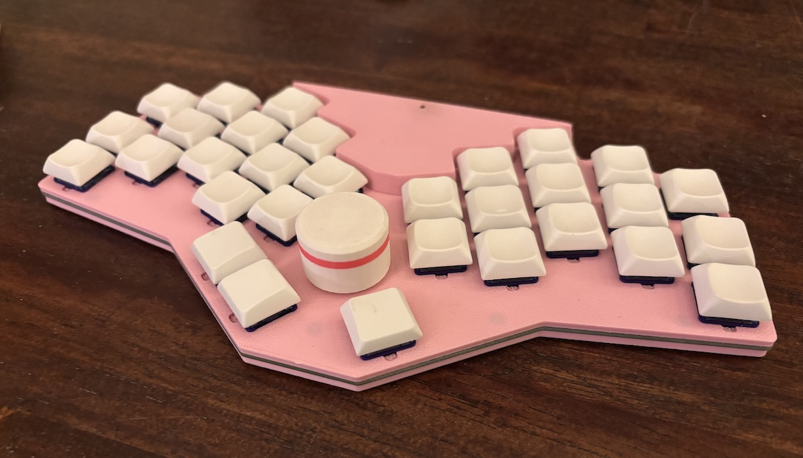

# One Up Chuck Keyboard

I haven't had a non-split ergonomic keyboard before,
so I thought I'd give one a try, but none of the
existing boards had what I wanted. Hence:
the One Up Chuck.

## Features

- 30 key wireless ergo keyboard with aggressive pinky stagger and splay
- central rotary encoder can be used by either hand
- Seeed Studio [XIAO BLE][xiao] microcontroller (probably also works with the XIAO RP2040)
- Gateron Low Profile hotswap switches
- 7mm low-profile "snug sandwich" case with no exposed components on top or bottom
- [RGB LED status][rgbled] visible on the top of the case
- Wireless-first design using [ZMK][zmk] [firmware][firmware] (including [ZMK Studio][studio])
- [PCB](images/pcb-one-up-chuck.jpg) designed with [ergogen][ergogen]
- Internal space (5.3 x 22 x 32 mm) for a "large" 502030 250mAh battery
- Licensed under the [CERN Open Hardware License v2][ohl]
- All source files available, so you can tweak the design if needed

## Design goals

- Low cost wireless
  - xiao ble is only $10 per controller compared to $25 for the nice!nano
  - Big battery and an option for a dongle, so you can run for months without recharging
- Ergonomic design for the ultimate comfort
  - each half is angled to match the angle of the hands on the board
  - keys are placed where fingers naturally fall, with no excessive stretching
    - when fingers extend, they splay, so the keys also splay outward to follow the fingers
    - the pinky is shorter than the other fingers, so the pinky keys are placed lower to match, and the top pinky key is traded for a ring finger key
    - the inner column of each hand is reduced to two keys
    - only one thumb key for each hand
  - centrally located rotary encoder knob for easy access to scrolling and volume control
  - includes all source files, so if your fingers are slightly different, with a little work you can adjust the keyboard to fit you exactly
- Low profile 3D printable case
  - case is only about 7mm high and comes in two separate pieces, each largely flat on one side for easy FDM printing with minimal fuss
  - smaller versions are included for smaller print beds
  - a few different knobs are included so you can get the height that works best for you
  - bumpons are inset into the case 1mm to minimize their height; they add only 1/2mm in height
- Hotswappable
  - keycaps and switches can be easily removed and exchanged so you can fine tune the feel
- Electrostatic protection
  - unlike other ultra-low-profile cases, no electronics are exposed on either the bottom or the top of the case
  - on the side of the case, the reset button and power switch are available, and the usb port is accessible

Still in its infancy, but the [Build Guide][guide] is started.

[ergogen]: https://ergogen.xyz
[firmware]: https://github.com/ctranstrum/chuck/tree/zmk
[guide]: BUILD.md
[ohl]: LICENSE.txt
[rgbled]: https://github.com/caksoylar/zmk-rgbled-widget
[studio]: https://zmk.dev/docs/features/studio
[xiao]: https://wiki.seeedstudio.com/XIAO_BLE/
[zmk]: https://zmk.dev
