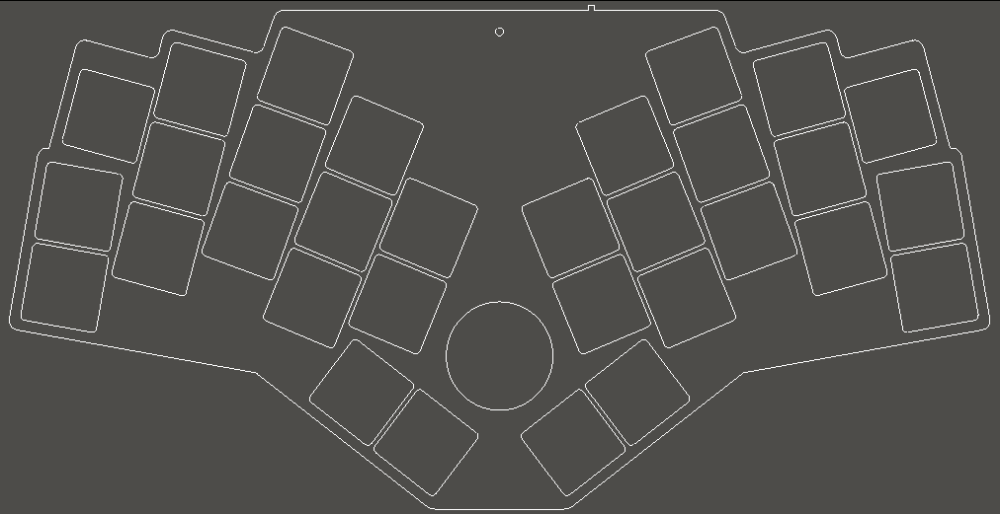

# Charlieflex Keyboard

I haven't had a non-split ergonomic keyboard before,
so I thought I'd give one a try, but none of the
existing boards had what I wanted. Hence:
the Charlieflex.

## Features

- 30-32 key wireless ergo keyboard with aggressive pinky stagger and splay
- central rotary encoder can be used by either hand
- designed for the Seeed Studio [XIAO BLE][xiao] wireless microcontroller
  - also works with the [XIAO RP2040][rp2040] for a lower-cost wired board
- Choc v1 or v2 low profile hotswap switches to allow a wider range of keycap choices
- Unique tiered low-profile "snug sandwich" case with no exposed electrical components
- [RGB LED status][rgbled] visible on the top of the case
- Wireless-first design using [ZMK][zmk] [firmware][firmware] (including [ZMK Studio][studio])
- Internal space (5.5 x 27 x 32 mm) for a "large" 502530 300mAh battery
- [PCB](images/chuck-pcb.jpg) designed with [ergogen][ergogen] for easy modification
- Licensed under the [CERN Open Hardware License v2][ohl]
- All source files available, so you can tweak the design if needed

## Design goals

- Low cost wireless
  - xiao ble is only $10 per controller compared to $25 for the nice!nano
  - Big battery and an option for a dongle, so you can run for months without recharging
  - xiao rp2040 is under $5 with no need to purchase a battery or power switch if you want a wired board
- Ergonomic unibody design for the ultimate comfort and easy portability
  - each half is angled to match the angle of the hands on the board
  - keys are placed where fingers naturally fall, with no excessive stretching
    - when fingers extend, they splay, so the keys also splay outward to follow the fingers
    - the pinky is shorter than the other fingers, so the pinky keys are placed lower to match, and the top pinky key is traded for a ring finger key
    - the inner column of each hand is reduced to two keys to eliminate the need for index finger stretching
  - centrally located rotary encoder knob for easy ambidextrous access to scrolling and volume control
  - includes all source files, so if your fingers are slightly different, with a little work you can adjust the keyboard to fit you exactly
- Low profile 3D printable case
  - case is only about 7mm high in front and 15mm high in the back, and comes in three separate pieces, each largely flat on one side for easy FDM printing with minimal fuss
  - options for 1 or 2 thumb keys on each hand so you can go minimal if desired
  - smaller versions are included for smaller print beds
  - a few different knobs are included so you can get the height that works best for you
  - bumpons are inset into the case 1mm to minimize their height; they add only 1/2mm in height
- Hotswappable
  - keycaps and switches can be easily removed and exchanged so you can fine-tune the feel
  - ability to move back and forth between choc v1 and choc v2
- Electrostatic mitigation
  - unlike other ultra-low-profile cases, no electronics are left exposed
  - usb port and power switch are on the back, reset switch is recessed into the bottom of the case

## Build Guide

Interested in building a Charlieflex of your own?
Check out the [Build Guide][guide] for details.

My Charlieflex, in the Twentyone Chuck Street layout, with 2 keys for the left thumb and one key for the right.
I'm using [LDSA keycaps][ldsa] on [Twilight Ambient Choc v1 switches][twilight].

[ergogen]: https://ergogen.xyz
[firmware]: https://github.com/ctranstrum/chuck/tree/zmk
[guide]: BUILD.md
[ldsa]: https://lowprokb.ca/collections/keycaps/products/ldsa-low-profile-blank-keycaps
[ohl]: LICENSE.txt
[rgbled]: https://github.com/caksoylar/zmk-rgbled-widget
[rp2040]: https://www.seeedstudio.com/XIAO-RP2040-v1-0-p-5026.html
[studio]: https://zmk.dev/docs/features/studio
[twilight]: https://lowprokb.ca/products/ambients-silent-choc-switches?variant=44873426436260
[xiao]: https://wiki.seeedstudio.com/XIAO_BLE/
[zmk]: https://zmk.dev
