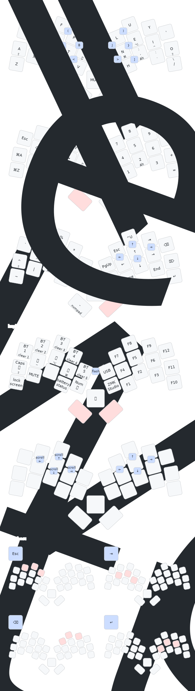

# One Up Chuck Keyboard ZMK Firmware

This repo contains the firmware for the [One Up Chuck Keyboard][chuck].

To use it, you have two choices:

- download the pre-compiled firmware from the Actions tab of this repository.
- create your own custom firmware.

## Download pre-compiled firmware

The pre-compiled firmware comes with the keymap shown at the bottom of this page,
and also includes [ZMK Studio][studio] that allows you to customize the keymap to
your preferences.

Go into the latest successful "Build default firmware" workflow run
from the [Actions tab][actions] of this repository,
scroll to the Artifacts section at the bottom of the page,
and click on the "firmware" link to download the zipfile.
Note that you must be signed in to github to download.

Unzip the firmware to find the following firmware files:

- chuck-unibody: for using the keyboard without a dongle
- chuck-peripheral: for using the keyboad with a dongle
- chuck-dongle: to install the firmware onto the [Prospector ZMK dongle][prospector]
- chuck-wired-rp2040: if you use the xiao rp2040 mcu
- xiao-ble-reset: used to clear all bluetooth connections and other saved settings
- xiao-rp2040-reset: used to clear all saved settings on a wired build

Plug the One Up Chuck keyboard into your computer's USB port,
double-tap the reset button on the keyboard,
and then copy the appropriate firmware file matching your configuration
onto the new shared drive, which should be labeled something like XIAO-SENSE.

Your computer will likely give you an error,
since installing the firmware causes the keyboard to immediately reset,
which the computer dislikes, but you can safely ignore the error
and start using the keyboard.

## Create your own firmware

Follow the instructions for [creating your own ZMK firmware repo][zmk]
but note that the One Up Chuck keyboard is an out-of-tree keyboard so you will not
find it in the list of keyboards, but don't panic, we will make the necessary
changes to get it working.

Add this module to your `config/west.yml` by adding a new entry to both
`remotes` and `projects`:

```yaml
manifest:
  remotes:
    - name: zmkfirmware
      url-base: https://github.com/zmkfirmware
    - name: ctranstrum # <-- add this for the keyboard
      url-base: https://github.com/ctranstrum
    - name: caksoylar # <-- and this for the LED
      url-base: https://github.com/caksoylar
    - name: carrefinho # <-- if you want a dongle you can use this or another adapter
      url-base: https://github.com/carrefinho
    - name: englmaxi # <-- another option for a dongle
      url-base: https://github.com/englmaxi
  projects:
    - name: zmk
      remote: zmkfirmware
      revision: main
      import: app/west.yml
    - name: chuck # <-- add this for the keyboard
      remote: ctranstrum
      revision: zmk
    - name: zmk-rgbled-widget # <-- and this for the LED
      remote: caksoylar
      revision: main
    - name: prospector-zmk-module # <-- something like this for the dongle
      remote: carrefinho
      revision: main
    - name: zmk-dongle-display # <-- alternate dongle
      remote: englmaxi
      revision: main
  self:
    path: config
```

Then, choose one of the following to add to your `build.yaml` file:

For a wireless One Up Chuck:

```yaml
include:
  - board: seeeduino_xiao_ble
    shield: one_up_chuck_unibody rgbled_adapter
    snippet: studio-rpc-usb-uart
    artifact-name: chuck-unibody
```

For One Up Chuck with a dongle:

```yaml
include:
  - board: seeeduino_xiao_ble
    shield: one_up_chuck_dongle prospector_adapter
    snippet: studio-rpc-usb-uart
    artifact-name: chuck-dongle
  - board: seeeduino_xiao_ble
    shield: one_up_chuck_peripheral rgbled_adapter
    artifact-name: chuck-peripheral
```

For a wired One Up Chuck with the XIAO RP2040:

```yaml
- board: seeeduino_xiao_rp2040
  shield: one_up_chuck_unibody rgbled_adaper
  snippet: studio-rpc-usb-uart
  artifact-name: chuck-wired-rp2040
```

Modify your `config/one-up-chuck.conf` file with these suggested changes:

```conf
# Enable encoder
CONFIG_EC11=y
CONFIG_EC11_TRIGGER_GLOBAL_THREAD=y

# Enable mouse scrolling on the encoder
CONFIG_ZMK_POINTING=y
CONFIG_ZMK_POINTING_SMOOTH_SCROLLING=y

# Enable ZMK Studio
CONFIG_ZMK_STUDIO=y
```

See the pre-compiled firmware [config file][config]
for additional settings you may want to consider.

To customize the keymap for your One Up Chuck board,
you can copy the [default keymap][keymap] from this repo
to the `config` directory of your zmk config repo
and edit it from there.

## Default Keymap

The keymap starts off by using Colemak-DH as the base,
but it is missing the B and J keys.
You can access those keys by using combos:
press P and G simultaneously for B,
and M and L for J.

Additional two-finger combos are used for brackets:

- { and } are S-T and N-E
- ( and ) are F-P and L-U
- \[ and \] are C-D and H-,
- < and > are T-V and N-K

The following three-finger combos are available:

- Escape is W-F-P
- Tab is R-S-T
- Backspace is L-U-Y
- Enter is N-E-I

Left thumb key is a sticky shift. Press and release it once to
capitalize the next letter typed. Press and release twice to enter
a smart word capitalization mode that automatically exits when you
finish typing a word.

Hold the left thumb key to get a numpad under your right hand,
as well as to access common editing commands under your left hand.

The right thumb key is the space bar, and when held, it puts
symbols under the left hand and navigation under the right.

Hold both the left and right thumb keys to access special keyboard
functions like changing the bluetooth connection (press a BT key to
switch to that connection, or hold it to clear the connection),
giving access to ZMK Studio, or flash a new firmware through a combo
on G-M.

The rotary encoder acts as mouse scroll on the default layer,
as volume control when either thumb key is pressed, and
it controls the screen brightness when both thumbs are held.

See the graphic below for more details:



[actions]: https://github.com/ctranstrum/chuck/actions
[chuck]: https://github.com/ctranstrum/chuck
[config]: config/one-up-chuck.conf
[keymap]: https://github.com/ctranstrum/chuck/tree/zmk/boards/shields/chuck/one_up_chuck.keymap
[prospector]: https://github.com/carrefinho/prospector
[studio]: https://zmk.studio
[zmk]: https://zmk.dev/docs/user-setup#github-repo
