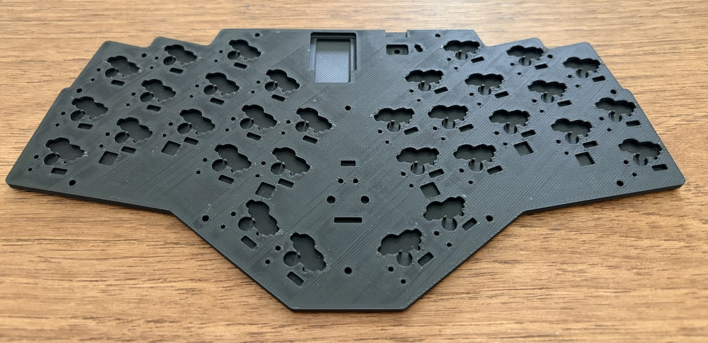
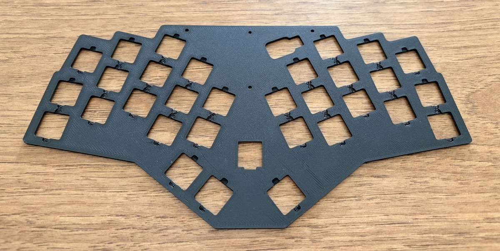
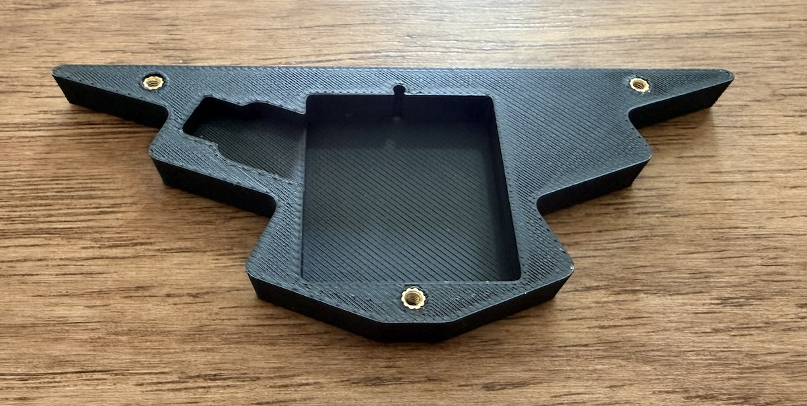
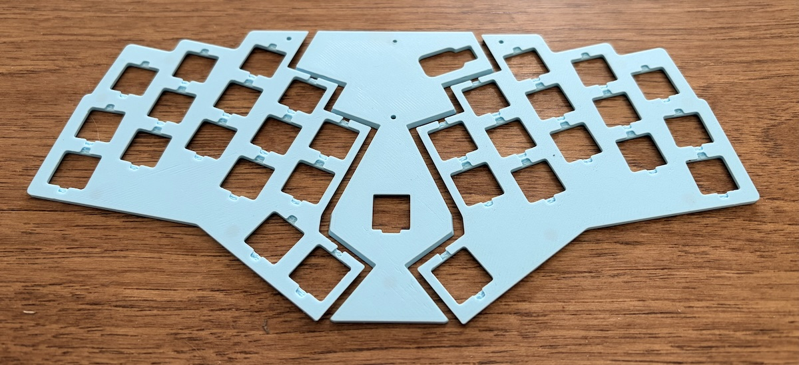
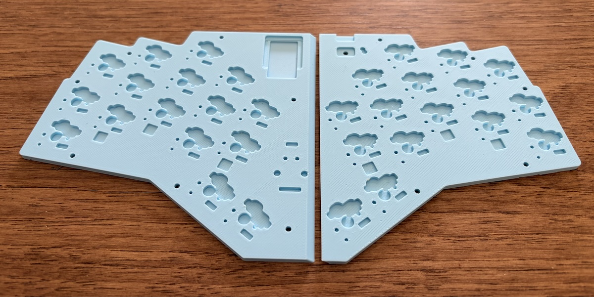
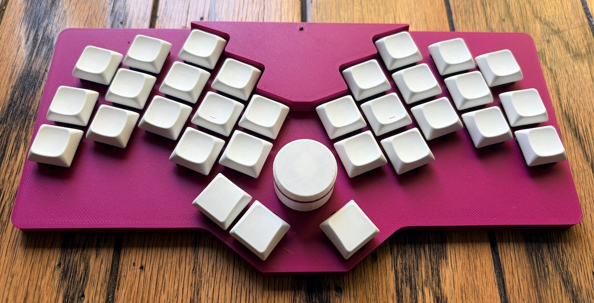
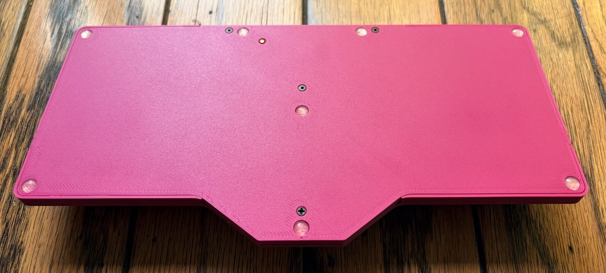
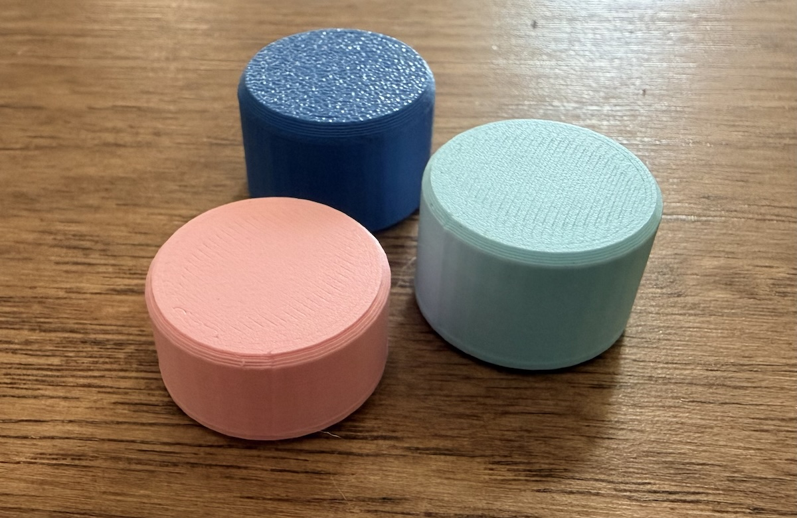

# Charlieflex Cases

> A quick note: these files were created through ergogen and can be
> modified and re-created if any changes are needed, which is great,
> except that the software is still a little bit buggy, so it doesn't
> make perfect STL files. Even though these can look a little strange,
> I have printed all of these files and they came out okay for me.

## Keyboard case files

### Full size printer

If you have access to your own 3D printer with a large print bed
or if you are sending the files away to be printed,
you will want to use the full size cases:

| wired                           | wireless                   | description                                             |
| ------------------------------- | -------------------------- | ------------------------------------------------------- |
| [bottom](wired_bottom_case.stl) | [bottom](bottom_case.stl)  | installed below the PCB                                 |
| [top](wired_top_case.stl)       | [top](top_case.stl)        | installed above the PCB for two thumb keys on each side |
|                                 | [battery cover](attic.stl) | above the top plate (do not print in resin)             |

There are three alternative top cases that can be used
depending on the number of thumb keys used on each hand:

| wired                                                               | wireless                                                      | description                                          |
| ------------------------------------------------------------------- | ------------------------------------------------------------- | ---------------------------------------------------- |
| [one up chuck](wired_top_case_one_up_chuck.stl)                     | [one up chuck](top_case_one_up_chuck.stl)                     | one thumb key on each hand                           |
| [twentyone chuck street](wired_top_case_twentyone_chuck_street.stl) | [twentyone chuck street](top_case_twentyone_chuck_street.stl) | two thumb keys on the left hand and one on the right |
| [chucker by the dozen](wired_top_case_chucker_by_the_dozen.stl)     | [chucker by the dozen](top_case_chucker_by_the_dozen.stl)     | one thumb key on the left hand and two on the right  |

Note that for best results on an FDM printer, the top plate and the battery cover should be printed upside down.

### Mini printer

If you have access to your own 3D printer
but it has a print bed too small for the full-size case,
you can print the 3-part (plus the battery cover for wireless builds) top case:

| wired                                     | wireless                            | description                                                      |
| ----------------------------------------- | ----------------------------------- | ---------------------------------------------------------------- |
| [center](wired_top_dovetail.stl)          | [center](top_dovetail.stl)          | center dovetail piece                                            |
| [left 1](wired_top_dovetail_left_1.stl)   | [left 1](top_dovetail_left_1.stl)   | left piece with one thumb key                                    |
| [left 2](wired_top_dovetail_left_2.stl)   | [left 2](top_dovetail_left_2.stl)   | left piece with two thumb keys                                   |
| [right 1](wired_top_dovetail_right_1.stl) | [right 1](top_dovetail_right_1.stl) | right piece with one thumb key                                   |
| [right 2](wired_top_dovetail_right_2.stl) | [right 2](top_dovetail_right_2.stl) | right piece with two thumb keys                                  |
|                                           | [battery cover](attic.stl)          | above the top plate to cover the battery (do not print in resin) |

Note that these top cases should be printed upside down for best results on an FDM printer.

The bottom case is broken into two pieces:

| wired                                    | wireless                           | description  |
| ---------------------------------------- | ---------------------------------- | ------------ |
| [left](wired_bottom_dovetail_left.stl)   | [left](bottom_dovetail_left.stl)   | left bottom  |
| [right](wired_bottom_dovetail_right.stl) | [right](bottom_dovetail_right.stl) | right bottom |

### Rectangular snap-fit case

I've also created an alternative case that uses fewer screws and instead relies on a snap-fit design
to remain securely fastened without sacrificing any additional height compared to the original sandwich design.

Unlike the sandwich-style cases, it is available only for full-size printer beds,
and only for a wireless build.

| wireless                                                                | description                                                      |
| ----------------------------------------------------------------------- | ---------------------------------------------------------------- |
| [bottom](rectangle_bottom_case.stl)                                     | bottom case                                                      |
| [top](rectangle_top_case.stl)                                           | top case option with two thumb keys on each hand                 |
| [one_up_chuck](rectangle_top_case_one_up_chuck.stl)                     | top case option with one thumb key on each hand                  |
| [twentyone_chuck_street](rectangle_top_case_twentyone_chuck_street.stl) | top case option with two left thumb keys and one right thumb key |
| [chucker_by_the_dozen](rectangle_top_case_chucker_by_the_dozen.stl)     | top case option with one left thumb key and two right thumb keys |
| [battery cover](attic.stl)                                              | above the top case to cover the battery (do not print in resin)  |

Note that it is especially important when printing this case style on an FDM printer to place the top case
upside down in the slicer so that the top surface of the case is in direct contact with the print bed.
Otherwise you are going to have a real struggle with support removal.

## Print quality hints

When printing this case,
it should be noted that the battery cover (filename: `attic.stl`) is designed
to have heat-set inserts melted into it,
so it is not recommended to print using a resin printer
or using a material that cannot be melted easily,
unless you plan on altering the case design to use another method
to fasten the case together.

All other parts of the case can be printed in whatever material you like.

For FDM printing,
the top case and the attic are best printed upside down,
so that the visible part of the case is against the print bed,
giving the best top surface and requiring minimal supports to print.

If you are having trouble with some of the raised areas sagging during printing,
you can try to enable supports.
While I was able to tune my printer to get great results without supports,
if your printer is not well calibrated,
it may be worth it to enable supports and spend a little time
post-processing the prints to remove the supports prior to assembly.

## Encoder knobs

The keyboard was designed with the idea of using a 25mm diameter knob,
but I had a hard time finding encoder knobs that size,
especially for an EC12 low-profile encoder.

If you use the recommended EC11 encoder,
you should have plenty of commercially available options for the knob,
so feel free to use whatever knob you like.

But I've also created a super-simple one with a skirt
so that as much of the encoder as possible is hidden.

- [ec11_encoder_knob.stl](ec11_encoder_knob.stl)
- [ec12_encoder_knob.stl](ec12_encoder_knob.stl)

Both of those knobs will give about the same look,
but if you use a low-profile EC12 knob,
you have the ability to go with a shorter knob:

- [encoder_knob-15mm.stl](encoder_knob-15mm.stl)
- [encoder_knob-13mm.stl](encoder_knob-13mm.stl)
- [encoder_knob-10mm.stl](encoder_knob-10mm.stl)

All of the encoder files can be printed as-is with no supports.
